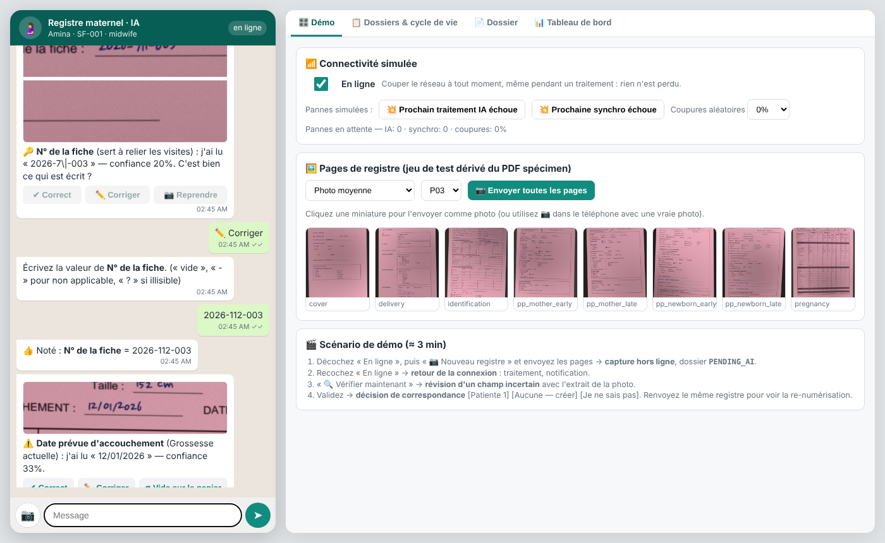

# Sage-femme · Registre · IA — CodeML DayOne challenge

**FR** — Un agent conversationnel de type WhatsApp, hors ligne d'abord, qui transforme les photos du registre maternel papier en dossier numérique structuré et longitudinal. Chaque champ a un statut explicite et une confiance. La sage-femme vérifie au lieu de ressaisir, et l'agent ne cache jamais ses doutes. Le registre papier reste l'outil de référence.

**EN** — An offline-first, WhatsApp-style agent that turns photos of the paper maternal registry into a structured, longitudinal record. Every field has an explicit status and a confidence. The midwife verifies instead of retyping, and the agent never hides its doubts. The paper registry stays the reference: nothing about the midwife's practice changes.

```
┌──────────── phone (works offline) ─────────────┐        ┌────── online layer ───────┐
│ WhatsApp-style chat (agent.py)                  │        │ AI processing (worker.py) │
│  capture → quality gate → page recognition      │ queue  │  local template OCR       │
│  (SIFT template alignment, no OCR needed)       │──────▶ │  + vision LLM (optional)  │
│  PII located & redacted before anything leaves  │        │  status + confidence      │
│  encrypted store: SQLite/WAL + Fernet blobs     │ ◀──────│  consistency checks       │
│  review · manual entry · patient linking        │        ├───────────────────────────┤
└─────────────────────────────────────────────────┘  sync  │ central DB (central.py)   │
                                                    ─────▶ │ cross-device duplicates   │
                                                           │ anonymised dashboard      │
                                                           └───────────────────────────┘
```

## Quick start

```bash
apt install tesseract-ocr                      # or: brew install tesseract
pip install -r requirements.txt
python -m tools.build_dataset                  # specimen PDF -> test set (80 pages x 3 photo qualities) + ground truth + templates
python -m sagefemme.server --fresh             # http://127.0.0.1:8000  (PIN 1234)
python -m unittest discover -s tests -v        # 20 tests, including a full conversation on real photos
python -m tools.evaluate --jobs 4              # extraction + uncertainty metrics -> reports/eval_report.json
```

Optional vision-LLM backend (online layer). The image is always redacted on the device before it is sent:

```bash
export ANTHROPIC_API_KEY=...                    # Claude, or any OpenAI-compatible endpoint, e.g. a
# export VLM_BASE_URL=http://localhost:11434/v1 VLM_MODEL=qwen2.5vl   # self-hosted model in the health network
python -m tools.evaluate --vlm                  # fused local OCR + VLM
```

## Demo (the 4 required moments, ≈ 3 min)

Recorded walkthrough: [`docs/demo/demo.mp4`](docs/demo/demo.mp4) (1 min 46 s, sped up ×1.6), plus screenshots in `docs/demo/`. To regenerate it: `python -m sagefemme.server --fresh &` then `python tools/record_demo.py docs/demo`.



In the web prototype, the right-hand panel drives the demo. It lets you cut the network, inject failures, and send test-set pages as photos. You can also use 📷 with a real photo.

1. **Offline capture.** Untick *En ligne*, then tap *📷 Nouveau registre* and send the 8 pages. Each page is recognised on the device ("Page 3 reçue : Grossesse actuelle") and stored encrypted. *Terminer* puts the record in `PENDING_AI`, and the midwife can keep working.
2. **Connectivity returns.** Tick *En ligne*. The queue is processed (`AI_PROCESSED → NEEDS_REVIEW`) and the agent posts a summary such as "157 lus avec confiance, 27 à vérifier…".
3. **Review of an uncertain field.** For each doubt, the agent shows what it read, its confidence and **the excerpt of the photo**. The options are ✔ Correct / ✏️ Corriger / ∅ Vide / ❓ Illisible / 📷 Reprendre. Pregnancy-grid cells are reviewed one row at a time. A reading that fails validation (for example `28/m2/26` as a date) cannot be "confirmed"; it has to be typed.
4. **Match decision.** After validation, the agent offers *[Patiente 1] [Aucune — créer] [Je ne sais pas]*. Send the same registry again to see re-digitisation: the agent finds the existing patient, shows what is new or different, and offers *[Ajouter seulement les nouvelles infos] [Nouvelles infos + changements] [Choisir] [Garder l'existant]*.

The *Dossiers* tab shows the lifecycle live. The *Dossier* tab shows every field with its status chip, confidence, raw reading and source, plus the role-restricted original images and the audit trail. The *Tableau de bord* tab has the anonymised aggregates.

## What we found in the data (and what we did about it)

* **The specimen PDF is vector**: printed labels use Helvetica, handwriting uses 5 handwriting fonts (Caveat, Gaegu…), and ticks are blue or black vector strokes. `tools/build_dataset.py` reads this directly to get **exact ground truth for 6,030 fields** (603 fields × 10 patients). It renders each page as a clean scan, a "mild" phone photo and a "heavy" phone photo (perspective, rotation, shadow, low light, blur, noise, JPEG).
* **Some handwriting fonts lack accented glyphs and "—".** The text layer holds `U+0000` and *nothing is drawn* ("N ant" for "Néant", empty cells meant to hold "—"). Ground truth therefore follows what is visible: an all-missing value counts as blank, and a partial gap is a wildcard. A good agent should flag these words, and ours does.
* **No random patient code is printed on the specimen.** The linking key is the registry's **N° de la fiche**, which the agent always asks the midwife to confirm. Internal IDs (`PAT-7K3M-Q9XA`) are random.
* **Hepatitis C is not on the form** (only Ag HBs), so it is reported as missing and never imputed.
* **The 200-row CSV** is the analytic schema. Every validated record is exported into the same 30 columns (mean BP from the visit grid, BMI from first weight and height, preterm from GA at birth, and so on). The CSV seeds the epidemiology dashboard.

## Design choices

### 1. Schema first, not generic OCR — `sagefemme/forms/layout.py`
603 data fields over 8 page types: cover sheet, identification and history, current-pregnancy grid (30 rows × 9 visits), delivery, and early and late postpartum for both mother and newborn. Each field is defined by **its printed anchor label and a geometric rule** (inline, table cell, box below a header, checkbox, i-th checkbox in a row), a type, a validator and an importance level. The same definition drives ground-truth extraction, the page templates, the local OCR and the per-page JSON schema sent to the vision LLM. Direct identifiers (name, husband's name, CIN, phone, address, "MÈRE — Nom" header) are declared as `pii` regions. They are **located only so they can be blacked out** and are never extracted.

### 2. Status model — every field, never a bare "N/A"
| status | meaning | how it is decided |
|---|---|---|
| `KNOWN` | value trusted | confidence ≥ threshold (0.80 / 0.85 / 0.92 depending on importance) **and** validator passes, or confirmed by the midwife |
| `NEEDS_REVIEW` | something was read, but doubtful | low confidence, failed validator, failed cross-field check, or the two readers disagree |
| `ILLEGIBLE` | ink present, unreadable | ink detected but no reading |
| `NOT_PROVIDED` | blank on paper / page not photographed | no ink in the field region (or page missing: note "page non photographiée") |
| `NOT_APPLICABLE` | "—" or "/" on paper, or logically N/A | dash detector; rules (e.g. no C-section → no indication) |
| `UNKNOWN` | paper says "inconnu", "?" | token rules |

**Confidence** combines the recogniser score, the field validator (date / range / BP plausibility), lexicon snapping for categorical handwriting ("RAS", "Normales", "Céphalique"…), cross-field **consistency rules** and ensemble agreement. The consistency rules are DDR + 280 d = DPA, DPA + 7 d = term date, visit date vs gestational age, parity ≤ gravidity, and exclusive tick groups. Agreement raises confidence; a contradiction forces review.

### 3. Extraction pipeline — `sagefemme/extraction/`
* **On the device, offline, instantly at capture:** a quality gate (sharpness, light, contrast, resolution), then page recognition and a homography by **SIFT + RANSAC against the 8 page templates**. A short OCR of the title band separates early from late postpartum. This was 80/80 correct on the heavy photos. The PII regions are projected onto the photo here.
* **Online layer (AI processing):** template regions are rectified out of the photo. Handwriting is separated from the printed form **by ink colour** (blue pen on pink paper vs black print), with a darkness, line-removal and border-fragment fallback for black pens; the pen colour is decided per page. A lone dash becomes `NOT_APPLICABLE`. Ticks are measured by ink density inside the box. Values are read by Tesseract in batches. When configured, a **vision LLM** reads the redacted page with a page-specific schema and must return value + status + confidence per field. The two readings are **fused**: agreement → higher confidence; a confident disagreement → `NEEDS_REVIEW`, showing both candidates.

### 4. Conversational review — `sagefemme/agent.py`
* Multi-page sessions: pages can come in any order, duplicate pages are detected (replace or keep), and missing pages are announced. The record is created on the first photo, so even an interrupted capture is never lost and the agent offers to resume it.
* The review order is: **linking code first**, then single fields by importance, then grid **rows**. If there are more than 25 doubts, the midwife chooses "essentials only" or "everything". Every question carries the **photo excerpt** of that field or row.
* *Corriger* parses and validates the answer by type (dd/mm/yyyy, 120/80 or cmHg 12/8, weeks…). A whole grid row can be typed at once (`104/74; vide; 106/77; …`). Answers can also be `vide`, `-`, `?` or `inconnu`.
* The summary shows per-page counts. *Modifier un champ* takes `champ = valeur` with fuzzy field names (`TA T2 V3 = 120/80`), and *Reprendre une page* re-photographs one page: the record goes back to `PENDING_AI` and fields the midwife already confirmed on other pages are kept. Validating with doubts left keeps them as `NEEDS_REVIEW`; they are never silently promoted.
* **Full manual entry** works when the AI is unavailable or failed: essential questions page by page, and grid rows in one line.
* Bilingual FR/EN (`i18n.py`). `whatsapp.py` maps buttons to WhatsApp Cloud API interactive messages (≤ 3 → buttons, ≤ 10 → list), parses webhooks and verifies the `X-Hub-Signature-256`.

### 5. Offline-first state machine — `store.py`, `worker.py`, `net.py`
`CAPTURED → PENDING_AI → AI_PROCESSED → NEEDS_REVIEW → VALIDATED → PATIENT_MATCHED → REGISTERED → SYNCED`, plus `PROCESSING_FAILED`, `SYNC_FAILED`, `DUPLICATE_SUSPECTED` and `MANUAL_REVIEW_REQUIRED`. Transitions are whitelisted (`schema.TRANSITIONS`), so validation can never be skipped, and every transition is journaled.
* Every write is a single SQLite transaction (WAL, `synchronous=FULL`), and images are written atomically. A result is committed together with its state change, so if the connection drops mid-batch the record simply stays `PENDING_AI`.
* An AI failure is retried up to 3 times, then the record goes to `PROCESSING_FAILED` with [Réessayer] / [Saisie manuelle]. A sync failure leads to `SYNC_FAILED` with exponential back-off. Sync is **idempotent**: a lost acknowledgement means the same record is simply re-pushed, with no duplicate on the server (this is tested).
* **Encryption at rest:** the key is derived from the PIN with scrypt (Fernet = AES-CBC + HMAC). Records, patient profiles and image blobs are encrypted; the PIN check uses a canary. The registry code is indexed with an HMAC, not stored in clear.

### 6. Patient linking & privacy — `linking.py`
* Candidates come from an exact or near-identical code (OCR slips), age, province, expected delivery date and LMP. **The system never auto-creates a patient when a plausible match exists, and never merges by itself.** The options are *[Patiente 1] [Patiente 2] [Aucune — créer] [Je ne sais pas]*; "Je ne sais pas" leads to `DUPLICATE_SUSPECTED`, set aside for later.
* The central server flags a duplicate across devices (the same code registered as a different patient on another phone).
* Original images are kept on the device, encrypted and linked to the record ID, capture date, midwife ID, device ID and processing status. Access is **role-based** (midwife or supervisor yes, analyst no) and every access attempt is logged. Only **redacted** images and de-identified fields reach the central server or the AI. A regex guard scrubs phone/CIN patterns from any free text. The dashboard applies small-cell suppression (n < 5).

## Evaluation (local OCR backend, no network, no third party)

`python -m tools.evaluate` scores all 10 specimen patients × 3 photo qualities (6,030 fields per quality level):

| metric | clean scan | mild photo | heavy photo |
|---|---|---|---|
| Value accuracy (written values, exact after normalisation) | 67.2 % | 52.6 % | 24.0 % |
| Status accuracy (blank / dash / value detected correctly) | 97.4 % | 95.2 % | 93.1 % |
| Checkbox accuracy | 100.0 % | 99.6 % | 99.2 % |
| **Auto-accepted (`KNOWN`) precision** | 99.6 % | 99.4 % | 99.2 % |
| Auto-accept coverage (share of fields needing no human check) | 45.7 % | 42.3 % | 36.1 % |
| **Silent error rate** (`KNOWN` but wrong, over all fields) | 0.2 % | 0.3 % | 0.3 % |
| **Review catch rate** (wrong readings that were flagged) | 98.4 % | 98.4 % | 98.9 % |
| Expected calibration error of confidence | 0.078 | 0.057 | 0.062 |
| Seconds per 8-page registry (1 CPU core) | 23.3 | 27.6 | 34.0 |
| Direct identifiers stored (patient/husband names, CIN, phone) | 0 | 0 | 0 |

The automated leak test (`pii_leaks` in the report) only flags 4 hits, all on one field: the staff name "Sage-femme Salima" misread by OCR as "Salma", which happens to be a patient's first name. PII regions are never read at all.

Value accuracy by type (clean / mild / heavy): bool 93/50/24 %, bp 55/40/5 %, code 20/20/10 %, date 53/44/7 %, float 33/25/9 %, ga 66/48/16 %, int 55/40/16 %, lab 94/79/45 %, text 75/64/34 %.

How to read it: Tesseract is not a handwriting model, so the offline reader's **raw value accuracy** is modest and falls on degraded photos. That is why the system is built around **uncertainty**. Fields the agent marks `KNOWN` without human confirmation are right **≥ 99 %** of the time, at every quality level. Of the readings that are wrong, **≥ 98 %** are flagged for the midwife instead of being stored silently, and checkboxes are ≈ 100 % correct. The vision-LLM backend (`--vlm`) plugs into the same fusion and the same metrics, and is where the raw handwriting accuracy should come from. The local reader stays as the offline fallback and as a second opinion for the ensemble.

## Out of scope (by design)
No maternal risk prediction, triage, diagnosis or treatment advice. The dashboard is descriptive only. The "Grossesse classée à risque" ticks are transcribed as written by the midwife, never computed.

## Known limitations
* The local handwriting reader (Tesseract `eng`, no French model available offline here) is weak on handwriting fonts with ambiguous glyphs (1↔7) and on blurred photos. That costs coverage, not safety: those fields are flagged. The VLM backend is implemented but could not be benchmarked in this environment (no API key).
* Templates come from the 8 specimen layouts. A new form version needs a template (one PDF/scan page + `layout.py` anchors).
* The specimen has no Arabic or English handwriting. The VLM prompt and the lexicons accept FR/AR/EN, but the local OCR runs `eng` only.
* The demo runs device, AI and central in one process, with the network simulated. The "device" store would live in the phone app (SQLCipher / Android Keystore in production).
* Free-text fields use a lexicon for confidence. Uncommon words stay `NEEDS_REVIEW` until confirmed.

## Repository layout
```
sagefemme/
  forms/layout.py       603-field schema anchored on the printed form (+ PII regions)
  forms/geometry.py     anchor resolution (PDF points)      forms/pdfdoc.py  specimen text-layer reader
  forms/align.py        SIFT page recognition + homography   forms/templates.json, tpl_*.png
  extraction/           local_ocr.py · vlm.py · postprocess.py (statuses, confidence, consistency) · pipeline.py · lexicon.py
  schema.py             statuses, lifecycle transitions, typed normalisation
  store.py              encrypted on-device store           worker.py   offline queue, AI processing, sync
  central.py            simulated central DB                linking.py  candidates, re-digitisation merge
  agent.py, i18n.py     conversational flow (FR/EN)         whatsapp.py Cloud API adapter
  analytics.py          export to the CSV analytic schema + anonymised aggregates
  server.py + web/      WhatsApp-style web prototype, demo controls, record viewer, dashboard
tools/build_dataset.py  test set + ground truth + templates from the specimen PDF
tools/evaluate.py       metrics (accuracy, status, auto-accept precision, silent errors, calibration, PII leaks)
tests/                  unit tests + end-to-end conversation on real photos
data/reference/         organisers' CSV (200 rows)          data/testset/ (generated)
```
